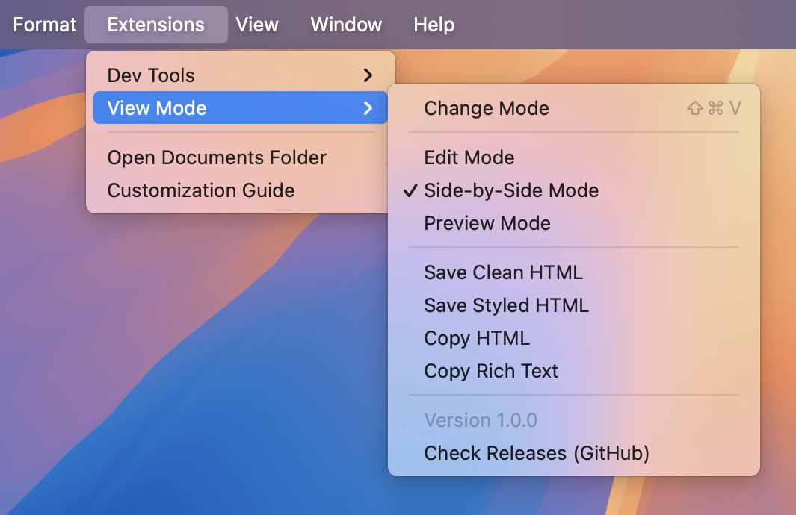

# MarkEdit-preview

Markdown preview for MarkEdit that leverages [markedit-api](https://github.com/MarkEdit-app/MarkEdit-api).

## Installation

Copy [dist/markedit-preview.js](dist/markedit-preview.js?raw=true) to `~/Library/Containers/app.cyan.markedit/Data/Documents/scripts/`. Details [here](https://github.com/MarkEdit-app/MarkEdit/wiki/Customization#entries).

Use [dist/lite/markedit-preview.js](dist/lite/markedit-preview.js?raw=true) if you don't need [mermaid](https://mermaid.js.org/), [katex](https://katex.org/) and [highlight.js](https://highlightjs.org/), it's much smaller (4 MB vs 170 KB).

> Once installed, restart MarkEdit to apply the changes.
>
> This extension automatically checks for updates and notifies you when a new version is available.

## Building

Run `yarn install && yarn build` to build and deploy the script.

To build the lite version, run `yarn build:lite` instead.

## How to Use

Access it from the `Extensions` menu in the menu bar, or use the keyboard shortcut <kbd>Shift–Command–V</kbd>.



To display local images, please ensure you're using MarkEdit 1.24.0 or later and follow [the guide](https://github.com/MarkEdit-app/MarkEdit/wiki/Customization#grant-folder-access) to grant file access.

## Styling

This extension applies the [github-markdown](https://github.com/sindresorhus/github-markdown-css) styling. You can customize the appearance by following the [customization](https://github.com/MarkEdit-app/MarkEdit/wiki/Customization) guidelines.

The preview pane can be styled using the `markdown-body` CSS class.

## Settings

In [settings.json](https://github.com/MarkEdit-app/MarkEdit/wiki/Customization#advanced-settings), you can define a settings node named `extension.markeditPreview` to configure this extension, default settings are:

```json
{
  "extension.markeditPreview": {
    "autoUpdate": true,
    "syncScroll": true,
    "hidePreviewButtons": true,
    "changeMode": {
      "modes": ["side-by-side", "preview"],
      "hotKey": {
        "key": "V",
        "modifiers": ["Command"]
      }
    },
    "markdownIt": {
      "preset": "default",
      "options": {}
    }
  }
}
```

- `autoUpdate`: Whether to enable automatic update checks.
- `syncScroll`: Whether to enable scroll synchronization.
- `hidePreviewButtons`: Whether to hide the built-in preview buttons (doesn't apply for lite build).
- `changeMode.modes`: Define available preview modes for the "Change Mode" feature.
- `changeMode.hotKey`: Assign keyboard shortcuts for mode switching. See the specification [here](https://github.com/MarkEdit-app/MarkEdit/wiki/Customization#generalmainwindowhotkey).
- `markdownIt.preset`: Override the default [markdown-it](https://markdown-it.github.io/markdown-it/#MarkdownIt.new) preset.
- `markdownIt.options`: Customize [markdown-it](https://markdown-it.github.io/markdown-it/#MarkdownIt.new) options.

> Extension settings require MarkEdit 1.24.0 or later.
